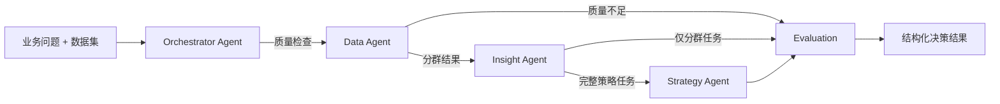

# AI Customer Intelligence Agent 架构

## 1. 设计原则

- 规则与统计负责“识别”，Agent 负责“编排、解释与策略生成”。
- Agent 之间只通过结构化共享状态协作，不进行不可控的自由对话。
- 原始交易明细留在数据工具层；模型增强只接收聚合证据。
- 无模型密钥时仍可完整运行，避免 Demo 依赖外部服务。
- 所有策略都必须带证据摘要、限制与可验证指标。

## 2. 3+1 Agent 边界

### Orchestrator Agent

解析业务问题，选择 `quality_only`、`segment_only` 或 `full_strategy` 路由，并记录执行计划。

### Data Agent

调用字段映射、质量报告、标准化、去重、退款与异常处理、用户特征、RFM、规则分群、KMeans 辅助工具。

### Insight Agent

根据聚合证据解释消费动机和需求，同时给出替代解释、限制与样本风险。不得推断身份或敏感属性。

### Strategy Agent

生成产品机会、机制、权益、页面信息架构、视觉关键词、slogan 和实验验证指标。输出是方向草案，不伪装成上线设计。

## 3. 动态分支

| 路由 | 触发任务 | 输出 |
|---|---|---|
| `quality_only` | 字段、缺失、质量、可分析性 | 质量报告 |
| `segment_only` | 只做人群识别 | 质量报告、分群、洞察 |
| `full_strategy` | 策略、页面、专题、权益、文案 | 完整人群策略卡 |

数据未达到门槛时，无论原始路由是什么，都会在 Data Agent 后回退到质量报告，不继续生成结论。

## 4. Memory 与治理

- 短期 Memory 位于 LangGraph 共享状态，只在单次分析任务内存在。
- 长期 Memory 只保存完整度达标的聚合策略案例，包含版本与来源。
- 删除数据集会同步删除分析、审计事件和相关 Memory。
- 未经确认的高风险结论不会进入长期 Memory。

## 5. Evaluation

每次任务计算：

- 完整度
- 证据覆盖率
- 策略可执行性
- 页面与 slogan 区分度
- 低置信度和低质量告警

审计事件会记录 Agent、工具阶段、关键统计和执行时间，便于复盘。

