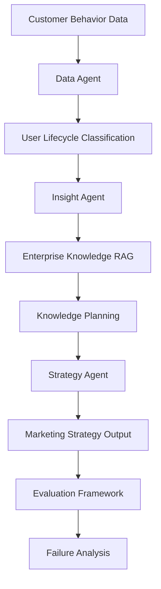

# System Architecture

| 模块 | 输入 | 处理 | 输出 | 产品价值 |
|---|---|---|---|---|
| Data Agent | 消费行为 CSV | 清洗、canonical mapping、偏好统计 | 用户分群与行为特征 | 统一数据口径 |
| Lifecycle Classification | 用户级特征 | 规则化生命周期识别 | lifecycle tags/evidence | 避免商品分群替代生命周期 |
| Insight Agent | 分群与用户特征 | 生成画像、证据和机会 | insight records | 将统计转成业务洞察 |
| Enterprise RAG | 业务问题、知识库 | Intent routing、query expansion、rerank | retrieval artifacts | 让企业知识可追踪 |
| Knowledge Planning | 检索结果、业务目标 | 规划知识用途和目标字段 | knowledge plan | 连接知识与策略 |
| Strategy Agent | 洞察、规划、知识上下文 | 生成结构化营销方案 | strategy card/trace | 提升策略可执行性 |
| Evaluation | artifacts、golden labels | 规则化评分和失败定位 | metrics/reports | 形成可迭代闭环 |
