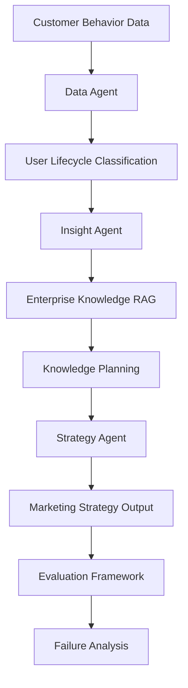

# Customer Intelligence Agent

## 1. 项目定位

Customer Intelligence Agent 是面向企业增长与营销团队的决策辅助系统。它将用户消费行为、用户生命周期、企业知识和营销策略串成一条可追踪、可评估的 Agent 链路。

传统流程通常是“人工分析数据→人工总结洞察→搜索企业经验→制定策略”，存在数据分散、企业知识难复用、策略不可解释和结果难验证的问题。本项目的目标不是替代营销专家，而是提升分析与策略设计效率，并让每一步都可诊断。

## 2. 产品输入与输出

输入：用户消费行为数据和业务问题。

输出：

- 商品消费偏好与用户分群
- 用户生命周期洞察
- 企业知识检索结果
- 知识驱动的营销策略
- 可追溯的 Evaluation Artifact 与失败原因

## 3. 系统架构

## 4. Evaluation 设计

系统使用 3 套 Benchmark、12000 用户和 45 个营销问题，并为四层 Agent 设置 Golden Label、规则指标和持久化 artifacts：

- Data：D1 消费偏好准确率、D2 分布相似度
- Insight：I1 生命周期识别、I2 洞察 grounding
- Knowledge：K1 Recall@3、K2 MRR
- Strategy：S1 Golden Coverage、S2 Knowledge Adoption、S3 Risk Violation
- Traceability：Knowledge→Business Concept→Strategy Field→Strategy Expression

## 5. 优化历程

Baseline OverallScore 为 65.53。通过问题定位和小步迭代，形成 Evaluation-driven Agent Optimization Loop：

1. Canonical Category Mapping 与单品类 tie 修复：DataScore 达到 93.43。
2. User-level Lifecycle Classification：InsightScore 达到 100。
3. Intent Routing、Query Expansion、Metadata Rerank：KnowledgeScore 达到 65.17。
4. Strategy Requirement Planning、Knowledge Plan、Knowledge Trace：StrategyScore 达到 75.37。
5. Business Concept Alignment：完整 v7 Grounding 平均 89.63%。

## 6. Final Evaluation v7

| Metric | Result |
|-|-:|
|Benchmark Dataset|3|
|Users|12000|
|Business Questions|45|
|DataScore|93.43|
|InsightScore|100.00|
|KnowledgeScore|65.17|
|StrategyScore|75.37|
|OverallScore|83.10|
|Knowledge→Strategy Grounding|89.63%|
|E2E Pass Rate|15.56% (7/45)|

实验模式为 deterministic_fallback。以上是离线 Benchmark 结果，不代表真实 GMV、收入或线上转化提升。

## 7. 项目价值

项目的核心成果不是声称模型“完美”，而是建立了可复现、可解释、可定位失败的 AI 产品 Evaluation 体系，并用真实失败案例驱动模块化优化。
